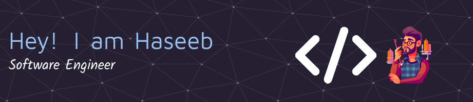

# 💫 About Me:
🔭 I’m Software Engineer from FAST-NUCES 👯 I’m looking for opportunities  🌱 I’m currently learning Machine Learning 💬 Ask me about Java, C++, Testing ⚡ Fun fact I am a Gamer

## 🌐 Socials:
   

# 💻 Tech Stack:
                 

### ✍️ Random Dev Quote

---

<!-- Proudly created with GPRM ( https://gprm.itsvg.in ) -->
